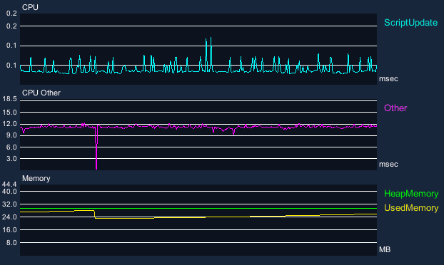

# Unityゲーム画面にProfiler機能っぽいの

Unityのゲーム画面にProfilerの計測値をグラフで表示する  

### 2通りの計測方法
+ Recorder方式
+ PlayerLoop計測方式

### 参考

+ [【CEDEC2018】一歩先のUnityでのパフォーマンス/メモリ計測、デバッグ術](https://www.slideshare.net/UnityTechnologiesJapan/unity-111054310)
+ [テラシュールブログ：【Unity】CPUプロファイラに表示されるの項目をスクリプトで取得する](http://tsubakit1.hateblo.jp/entry/2017/11/04/232336)
+ [渋谷ほととぎす通信：Unity Profilerによる計測時間をスクリプトから取得できた件](https://www.shibuya24.info/entry/customsampler)
+ [AllocationStats](http://wiki.unity3d.com/index.php/AllocationStats)
+ [http://posposi.blog.fc2.com/blog-entry-224.html](http://posposi.blog.fc2.com/blog-entry-224.html)
+ [凹みTips：Unity の Editor 拡張でインスペクタにグラフを描画する方法を色々調べてみた](http://tips.hecomi.com/entry/2014/06/23/222805)
